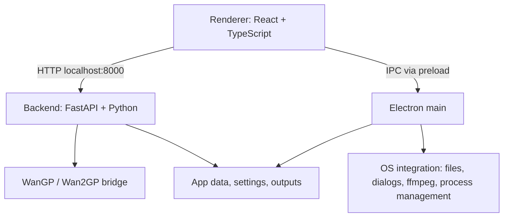

# AI Video Studio

AI Video Studio is a local-first desktop app for AI image and video generation, powered by WanGP / Wan2GP.

It is a fork of `deepbeepmeep/LTX-Desktop-WanGP` and keeps the inherited Electron, React, FastAPI, project, gallery, and editor foundations. The product direction is now AiVS: a community-focused creative studio with simple QuickGen workflows first, then deeper production tools later.

## Current Status

AiVS is in active development.

Working today:

- Local WanGP-backed image generation
- Local WanGP-backed video generation
- Project-based gallery and asset history
- Image model profiles with curated resolution/aspect controls
- Video model profiles using the same curated profile system
- Image input roles for models that support reference/control images
- WanGP runtime bridge with backend tests and fakes
- Inherited video editor retained as a beta/future workflow surface

Not yet complete:

- LoRA UI
- Full video input controls such as end frame, source video, and control video
- Audio/TTS QuickGen
- Production workflow

## Product Principles

- **Local-first:** normal generation should run locally through WanGP.
- **WanGP-only:** normal product generation should not call external generation APIs.
- **Curated models:** AiVS exposes tested model profiles, not every raw WanGP model or setting.
- **Simple first:** QuickGen should show useful creative controls, not raw technical configuration.
- **Preserve inherited systems:** projects, gallery, metadata, editor, Electron shell, and FastAPI structure are extended rather than rebuilt.

## Model Profiles

AiVS uses backend-owned curated model profiles exposed through `GET /api/model-profiles`.

Image profiles currently include:

- Z-Image Turbo
- Krea 2 Turbo
- Flux 2 Klein 4B
- HiDream O1

Video profiles currently include:

- LTX 2.3 Fast, routed to WanGP model `ltx2_22B_distilled_1_1`

Profiles define the user-facing model name, media type, WanGP model type, availability status, input capabilities, default settings, allowed aspect ratios, and allowed resolution tiers. The frontend renders model, resolution, and aspect controls from this profile API.

## Quick Start: Windows

Prerequisites:

- Windows 10/11
- NVIDIA GPU with CUDA support
- Node.js
- pnpm
- Git
- PowerShell

Recommended setup:

```powershell
pnpm setup:dev:win
pnpm dev
```

`setup:dev:win` prepares the backend environment, installs the WanGP GPU stack, and uses either:

- a repo-local `Wan2GP/` checkout, or
- an existing Wan2GP checkout pointed to by `WANGP_ROOT`.

To reuse an existing Wan2GP checkout:

```powershell
$env:WANGP_ROOT = "D:\Wan2GP"
pnpm setup:dev:win
pnpm dev
```

If both `.\Wan2GP` and `WANGP_ROOT` exist, the repo-local `.\Wan2GP` checkout is preferred.

## Quick Start: Linux

Linux support currently targets source/dev usage with WanGP.

Prerequisites:

- Node.js
- pnpm
- uv
- Git
- ffmpeg
- NVIDIA GPU with CUDA support
- WanGP checkout available locally or via `WANGP_ROOT`

```bash
export WANGP_ROOT=/path/to/Wan2GP
pnpm setup:dev:linux
pnpm dev
```

If `WANGP_ROOT` is not set, the setup script can prepare a repo-local `Wan2GP/` checkout.

## Runtime Notes

The backend uses Python 3.11.9, pinned by `.python-version`.

The Windows WanGP stack installer is:

```powershell
scripts/install-wangp-stack.ps1
```

Useful options:

```powershell
scripts/install-wangp-stack.ps1 -List
scripts/install-wangp-stack.ps1 -Stack cu130 -GpuGeneration RTX_40
scripts/install-wangp-stack.ps1 -SkipWan2gpRequirements
```

The installer detects NVIDIA GPU generation, selects the configured CUDA stack from `scripts/wangp-stacks.json`, and installs matching PyTorch plus curated performance wheels into `backend/.venv`.

## Development

Install dependencies:

```bash
pnpm install
```

Run the app:

```bash
pnpm dev
```

Run with debugging:

```bash
pnpm dev:debug
```

Typecheck:

```bash
pnpm typecheck
```

Backend tests:

```bash
pnpm backend:test
```

Frontend build:

```bash
pnpm build:frontend
```

If pnpm tries to recreate `node_modules` in a non-interactive terminal, set CI mode:

```powershell
$env:CI = "true"
pnpm typecheck:ts
```

## Architecture

AiVS has three main layers:



### Frontend

- Path: `frontend/`
- React 18, TypeScript, Vite, Tailwind
- Main QuickGen surface: `frontend/views/GenSpace.tsx`
- Model profile hook: `frontend/hooks/use-image-profiles.ts`
- Model profile types: `frontend/types/model-profiles.ts`

### Electron

- Path: `electron/`
- Owns app lifecycle, native dialogs, file access, export, and Python backend process supervision
- Renderer communicates through the preload bridge exposed as `window.electronAPI`

### Backend

- Path: `backend/`
- FastAPI server on port 8000
- Thin routes call handlers; handlers call services and mutate centralized state
- WanGP bridge: `backend/services/wangp_bridge.py`
- Model profiles: `backend/model_profiles/profiles.py`
- Resolution resolver: `backend/model_profiles/resolution_resolver.py`
- Profile API handler: `backend/handlers/model_profiles_handler.py`

## Key Commands

| Command | Purpose |
| --- | --- |
| `pnpm dev` | Start Vite, Electron, and backend |
| `pnpm dev:debug` | Start with Electron inspector and Python debugpy |
| `pnpm typecheck` | Run TypeScript and Python type checks |
| `pnpm typecheck:ts` | TypeScript only |
| `pnpm typecheck:py` | Pyright only |
| `pnpm backend:test` | Backend pytest suite |
| `pnpm build:frontend` | Build renderer and Electron bundles |
| `pnpm setup:dev:win` | Windows development setup |
| `pnpm setup:dev:linux` | Linux development setup |
| `scripts/install-wangp-stack.ps1` | Install/refresh WanGP GPU stack |

## Data Locations

App data uses the AiVS folder name.

- Windows: `%LOCALAPPDATA%\AiVS\`
- Linux: `$XDG_DATA_HOME/AiVS/` or `~/.local/share/AiVS/`
- macOS: `~/Library/Application Support/AiVS/`

Generated outputs are stored under the app data output directory and copied into project asset folders when saved to projects.

## Documentation

- `AGENTS_PRD.md` - product direction and guardrails
- `AGENTS.md` - coding-agent conventions
- `docs/PHASE0_AUDIT.md` - fork audit and preservation map
- `docs/PHASE4_DETAILS.md` - curated model profile brief
- `backend/architecture.md` - backend architecture
- `backend/WANGP_BACKEND.md` - WanGP bridge configuration
- `scripts/wangp-stacks.json` - curated GPU stack config

## Contributing

AiVS is changing quickly. Keep changes small, preserve inherited systems where possible, and route normal generation through WanGP only.

Before adding a model, add or update a curated profile in the backend profile registry. Do not expose arbitrary WanGP models directly in the UI.

## License

Apache-2.0. See `LICENSE.txt`.

Third-party notices and model terms may apply to downloaded models and WanGP dependencies.
