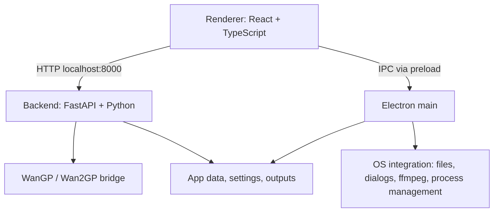

<p align="center"></p>
<p align="center">AI Video Studio</p>
<p align="center">A local-only desktop app for AI image and video generation<br>powered by WanGP.</p>

<p align="center"></p>

This WIP project is a fork `deepbeepmeep/LTX-Desktop-WanGP`.

Note: I'm more of a Solutions Architect than a coder, so I'm up-front clarifying that this is heavily coded by AI. But I have a vision of what this should be (essentially the ease-of-use of online AI Platforms, Magnific/Higgsfield etc, with the beauty of OSS and local-only AI Gen, and the power of WanGP behind it!) I can't guarantee it'll work great for everyone, so far I've only tested this on one of my systems (128gb ram - RTX 4070Ti Super) and its working great there, will try to test on other systems in due course.

# Product Principles

- **Local-Only:** Powered by WanGP, no cloud/third-party/off-site generations.
- **Curated models:** AiVS exposes tested - fast - model profiles, not every raw WanGP model or setting.
- **Simple first:** GenSpace should show useful creative controls, not raw technical configuration.

# Current Status

AiVS is in active development.

# New Features:

- Deeper integration with WanGP, removing all cloud/third-party/non-local elements.
- Streamlined app launch & added connection indicator & refresh button for connection to WanGP backend.
- Settings:
	- Added video/image output settings (Settings > Outputs)
	- Removed most other settings, but kept 'Torch-Compile' option and ensured it's hooked into WanGP. <p align="center"></p>
- Gallery:
	- Added ability to drag and drop your own items into gallery (for easier access to regular references etc)
	- Added Filtering (Type: Image/Video/Audio. Source: Generated/Uploaded)
	- Added 'Bin' (folder) support so you can easily organise your assets
	- Added 'List' view as an alternative to the grid views. <p align="center"></p>
  - Added a 'cancel' button and better indications of generation progress in asset cards.<p align="center"></p>
- GenSpace:
	- Prompting:
		- Added seed lock button to prompt box
		- added enhance prompt button to prompt box
		- moved media inputs above text prompt area and made it collapsible for tidier working. <p align="center"></p>
	- Image Gen:
		- Added Additional Image Models: Flux2 Klein 4b, Krea2 Turbo & HiDream O1, plus the existing z-image-turbo.
		- Added support for input images for supporting models, including a dropdown menu to select reference type (Transfer Human Pose, Transfer Depth, Transfer Canny Edges etc):
			- Z-Image-Turbo: Technically doesn't support inputs, but I've routed it so if you add one it'll use Z-Image-Turbo Fun ControlNet 6B v2.1 instead which can accept a controlnet image.
			- Flux2 Klein 4b natively allows reference images, I've allows up to 5, which I think is a sane amount (not sure how many it can take).
			- Krea2 Turbo currently doesn't support input images
			- HiDream O1 natively allows reference images, I've allows up to 5, which I think is a sane amount (not sure how many it can take). <p align="center"></p>
	- Video Gen:
		- Added Start/End frame support
		- Added Control Video/Audio support with video trim capabilities (note when a control video is added, the 'duration' setting turns to 'auto' and is controlled by the trim length).
		- Re-worked 'retake' mode a bit:
			- It now lives in video mode in a separate dropdown of current video modes (Generate/Retake/Reframe - More on this one next)
			- The UI & interaction with 'retake' mode also lives in the prompt area, not a separate page that takes over the gallery. <p align="center"></p>
		- Added new reframe mode with a nice easy to use framing UI that takes a control video and then uses ltx outpaint lora to expand edges. <p align="center"></p>
		- Added a 'Timing' switch in the text prompt area that lets you easily create timed prompts for videos and converts it to a compatible 'relay prompt' for WanGP in the background. <p align="center"></p>

# Planned

- LoRA UI
- Audio/TTS Gen
- Production workflow

## Quick Start: Windows

Prerequisites:

- Windows 10/11
- NVIDIA GPU with CUDA support
- Node.js
- pnpm
- Git
- PowerShell

Recommended setup:

```powershell
pnpm setup:dev:win
pnpm dev
```

`setup:dev:win` prepares the backend environment, installs the WanGP GPU stack, and uses either:

- a repo-local `Wan2GP/` checkout, or
- an existing Wan2GP checkout pointed to by `WANGP_ROOT`.

To reuse an existing Wan2GP checkout:

```powershell
$env:WANGP_ROOT = "D:\Wan2GP"
pnpm setup:dev:win
pnpm dev
```

If both `.\Wan2GP` and `WANGP_ROOT` exist, the repo-local `.\Wan2GP` checkout is preferred.

## Quick Start: Linux

Linux support currently targets source/dev usage with WanGP.

Prerequisites:

- Node.js
- pnpm
- uv
- Git
- ffmpeg
- NVIDIA GPU with CUDA support
- WanGP checkout available locally or via `WANGP_ROOT`

```bash
export WANGP_ROOT=/path/to/Wan2GP
pnpm setup:dev:linux
pnpm dev
```

If `WANGP_ROOT` is not set, the setup script can prepare a repo-local `Wan2GP/` checkout.

## Runtime Notes

The backend uses Python 3.11.9, pinned by `.python-version`.

The Windows WanGP stack installer is:

```powershell
scripts/install-wangp-stack.ps1
```

Useful options:

```powershell
scripts/install-wangp-stack.ps1 -List
scripts/install-wangp-stack.ps1 -Stack cu130 -GpuGeneration RTX_40
scripts/install-wangp-stack.ps1 -SkipWan2gpRequirements
```

The installer detects NVIDIA GPU generation, selects the configured CUDA stack from `scripts/wangp-stacks.json`, and installs matching PyTorch plus curated performance wheels into `backend/.venv`.

Development setup and backend test commands use `uv sync --inexact` so normal dependency syncs update declared backend packages without pruning WanGP requirements or performance wheels installed into the same virtual environment.

## Development

Install dependencies:

```bash
pnpm install
```

Run the app:

```bash
pnpm dev
```

Run with debugging:

```bash
pnpm dev:debug
```

Typecheck:

```bash
pnpm typecheck
```

Backend tests:

```bash
pnpm backend:test
```

Frontend build:

```bash
pnpm build:frontend
```

If pnpm tries to recreate `node_modules` in a non-interactive terminal, set CI mode:

```powershell
$env:CI = "true"
pnpm typecheck:ts
```

This repo pins `pnpm@10.30.3` through `package.json`. Use Corepack or the same pnpm version consistently to avoid `node_modules` reinstall prompts caused by package-manager metadata mismatches.

## Architecture

AiVS has three main layers:



### Frontend

- Path: `frontend/`
- React 18, TypeScript, Vite, Tailwind
- Main GenSpace surface: `frontend/views/GenSpace.tsx`
- Model profile hook: `frontend/hooks/use-image-profiles.ts`
- Model profile types: `frontend/types/model-profiles.ts`

### Electron

- Path: `electron/`
- Owns app lifecycle, native dialogs, file access, export, and Python backend process supervision
- Renderer communicates through the preload bridge exposed as `window.electronAPI`

### Backend

- Path: `backend/`
- FastAPI server on port 8000
- Thin routes call handlers; handlers call services and mutate centralized state
- WanGP bridge: `backend/services/wangp_bridge.py`
- Model profiles: `backend/model_profiles/profiles.py`
- Resolution resolver: `backend/model_profiles/resolution_resolver.py`
- Profile API handler: `backend/handlers/model_profiles_handler.py`

## Key Commands

| Command                           | Purpose                                          |
| --------------------------------- | ------------------------------------------------ |
| `pnpm dev`                        | Start Vite, Electron, and backend                |
| `pnpm dev:debug`                  | Start with Electron inspector and Python debugpy |
| `pnpm typecheck`                  | Run TypeScript and Python type checks            |
| `pnpm typecheck:ts`               | TypeScript only                                  |
| `pnpm typecheck:py`               | Pyright only                                     |
| `pnpm backend:test`               | Backend pytest suite                             |
| `pnpm build:frontend`             | Build renderer and Electron bundles              |
| `pnpm setup:dev:win`              | Windows development setup                        |
| `pnpm setup:dev:linux`            | Linux development setup                          |
| `scripts/install-wangp-stack.ps1` | Install/refresh WanGP GPU stack                  |

## Data Locations

App data uses the AiVS folder name.

- Windows: `%LOCALAPPDATA%\AiVS\`
- Linux: `$XDG_DATA_HOME/AiVS/` or `~/.local/share/AiVS/`
- macOS: `~/Library/Application Support/AiVS/`

Generated outputs are stored under the app data output directory and copied into project asset folders when saved to projects.

## Documentation

- `AGENTS_PRD.md` - product direction and guardrails
- `AGENTS.md` - coding-agent conventions
- `docs/PHASE0_AUDIT.md` - fork audit and preservation map
- `docs/PHASE4_DETAILS.md` - curated model profile brief
- `backend/architecture.md` - backend architecture
- `backend/WANGP_BACKEND.md` - WanGP bridge configuration
- `scripts/wangp-stacks.json` - curated GPU stack config

## Contributing

AiVS is changing quickly. Keep changes small, preserve inherited systems where possible, and route normal generation through WanGP only.

Before adding a model, add or update a curated profile in the backend profile registry. Do not expose arbitrary WanGP models directly in the UI.

## License

Apache-2.0. See `LICENSE.txt`.

Third-party notices and model terms may apply to downloaded models and WanGP dependencies.
