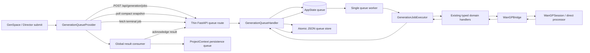

# AiVS Universal Generation Queue
## Detailed implementation plan for an AI coding agent

**Prepared:** 20 August 2026  
**Primary repository:** `GOvEy1nw/AI-Video-Studio` — `dev` at `f45a72ee6348d52d3ae791d384582f1356cd5255`  
**Inference repository:** `GOvEy1nw/Wan2GP` — `dev` at `9eac9c85b7da011f285527e041a068976f83e734`  
**Reference implementation:** `Blizaine/Maestro` — `main` / v1.9.0 at `811f0f3b26abe615ea2df9ac34833bb820cc2a86`

> This document is an implementation specification, not a loose feature brief. Before editing, re-read the current `AGENTS.md`, inspect the referenced files, and confirm that the branch has not materially changed since the commits above. Preserve newer compatible work rather than forcing this snapshot onto a changed codebase.

---

## 1. Agent brief

Implement a **persistent, backend-owned, automatically running generation queue** for AiVS.

A user must be able to submit further work while another generation is running. The queue must accept a mixed sequence such as:

1. image generation;
2. video generation;
3. another image generation;
4. music generation;
5. speech or sound-effect generation;
6. upscale, reframe, retake, or Director generation.

Queued items must be:

- executed one at a time on the single local inference lane;
- ordered FIFO by default;
- visible globally, not only while the originating GenSpace panel remains mounted;
- movable up or down while still queued;
- removable while still queued;
- cancellable while active;
- tied to the project and persistence intent captured at submission time;
- recoverable after a renderer reload or application restart;
- isolated so one failed or cancelled job does not stop later jobs.

The first release must remain lean. Do not add parallel GPU workers, cloud scheduling, a distributed task system, a drag-and-drop dependency, speculative retry logic, or a second queue inside Wan2GP.

---

## 2. Executive implementation decision

### 2.1 Put the canonical queue in the AiVS Python backend

The queue belongs **above** `WanGPBridge`, in AiVS.

AiVS owns information that Wan2GP does not and should not own:

- the originating AiVS project;
- whether the output becomes a new asset, a new take, a retake replacement, an upscale, or another project-specific result;
- the unified list of image, video, music, SFX, speech, upscale, reframe, retake, and Director jobs;
- global queue ordering and UI summaries;
- application restart recovery;
- output acknowledgement after Electron project persistence succeeds.

Wan2GP should remain the single-job inference executor and safety boundary. Its current `WanGPSession._submit_tasks(...)` explicitly rejects a second active session job, while its `SessionJob` already supplies job-scoped events and cancellation. That is useful enforcement, not the user-facing queue.

### 2.2 Use one execution lane

Run exactly one resource-owning queue job at a time.

This is not merely “one denoising loop at a time.” The active slot must cover the entire job, including:

- request validation that touches model/runtime state;
- model/profile resolution;
- LoRA/model download checks;
- image/video/audio preprocessing;
- crop/trim/outpaint materialisation;
- prompt encoding;
- model loading;
- denoising or audio inference;
- direct processors such as MMAudio;
- post-processing, muxing, and output finalisation;
- cleanup of temporary files.

Maestro required a follow-up fix after queued recast/SAM preprocessing could still run concurrently with the active generation. AiVS should avoid that class of bug from the outset by making the queue worker the only caller allowed to enter generation execution paths.

### 2.3 Make submission asynchronous

Generation submission must become an admission operation:

```text
POST request
    -> validate the queue envelope and cheap/static request constraints
    -> store an immutable job
    -> return 202 Accepted with job ID and queue position
```

The HTTP request must **not** remain open until generation completes.

The global queue provider then polls compact queue state and fetches terminal job details as needed. This replaces the current pattern where `useGenerationJob` owns one long-running request, one poller, one cancellation target, and one mutable result.

### 2.4 Automatically dispatch

AiVS should not copy Maestro's “held jobs + explicit Start Queue” interaction for the initial release.

Use:

- `queued` immediately after admission;
- automatic dispatch whenever the runtime is ready and no job is active;
- optional “pause after current” only as a future enhancement.

The user's stated need is to keep adding work without being blocked, not to build a batch staging mode.

### 2.5 Persist the queue

Persist queue state atomically to:

```text
<AIVS_APP_DATA_DIR>/generation-queue.json
```

Add the path to `RuntimeConfig`, rather than deriving it ad hoc in several files.

On startup:

- restore queued jobs;
- convert any previously `running` or `cancel_requested` job to `interrupted`;
- do **not** automatically rerun an interrupted job because output creation may have completed just before the crash;
- leave completed-but-unacknowledged jobs available for frontend persistence recovery;
- begin dispatch only after WanGP warm-up reports ready.

### 2.6 Use job-scoped result persistence

The current mutable `imageSubmissionRef`, `videoSubmissionRef`, `musicSubmissionRef`, and related refs are only safe for one outstanding job.

Replace them with an immutable, serialisable **client persistence context stored on each queue job**. The backend treats this context as versioned opaque JSON; the frontend owns its schema and uses it to write the output into the project captured when the job was submitted.

Add `generationJobId` plus `generationOutputIndex` provenance to persisted assets/takes. A terminal result is acknowledged to the backend only after project persistence succeeds.

---

## 3. Success criteria

The feature is complete only when all of the following are true.

### 3.1 Core user flow

- While a video is running, the user can submit an image.
- They can then submit music and another video without waiting.
- The Generate button remains usable and changes its wording to **Add to queue** while another job is active or waiting.
- The global queue shows the active job and all pending jobs in canonical backend order.
- The user can move any pending job up or down.
- The user can remove any pending job.
- The user can stop the active job.
- After stop/failure, the next pending job starts automatically.
- Changing panel settings after submission does not alter an existing queued job.
- Navigating away from GenSpace does not lose progress or result persistence.
- Switching projects does not redirect a result into the newly selected project.

### 3.2 Reliability

- Two rapid clicks cannot create accidental duplicate jobs.
- A renderer refresh reconnects to the same backend queue.
- A full app restart restores queued jobs and unacknowledged completed results.
- A job whose source media no longer exists fails clearly and the queue continues.
- Cancellation wins over a late success callback.
- Progress from job A can never appear on job B.
- The backend never starts two inference jobs concurrently.
- Direct SFX/MMAudio and other non-manifest paths cannot bypass the execution lane.
- Queue writes are atomic and a stale write cannot overwrite newer state.
- An output is not added twice after a frontend retry or restart.

### 3.3 Maintainability

- There is one canonical backend queue state machine.
- Routes remain thin.
- Existing typed request models are reused.
- Existing reusable UI controls and styling conventions are reused.
- No new drag-and-drop package is introduced for v1.
- Tests focus on queue lifecycle and data integrity, not exact layout dimensions or brittle text placement.
- No Wan2GP fork changes are required for the core release.

---

## 4. Source-driven current-state analysis

## 4.1 AiVS frontend

### `frontend/hooks/generation/useGenerationJob.ts`

The current hook represents one active operation:

- it owns one `GenerationState`;
- `runJob(...)` aborts the previous browser request/poll loop;
- it increments a run token so previous callbacks become stale;
- it opens a synchronous mode-specific generation request;
- it polls the global `/api/generation/progress`;
- it targets the global `/api/generate/cancel`;
- it stores one terminal result.

Submitting another generation through the same hook is therefore not equivalent to adding a queue item. It invalidates the previous frontend run even if the backend later gains a queue.

**Required direction:** replace the long-request lifecycle with a global queue client. Keep no second hidden “active job” manager.

### `frontend/hooks/generation/types.ts`

`GenerationState` combines:

- global generation flags;
- global progress;
- one result for each modality;
- one error/cancellation state.

That shape cannot represent mixed pending jobs or multiple completed results.

**Required direction:** introduce job and queue types, then expose a compatibility-derived view only where a panel still needs “is anything active?” during migration.

### `frontend/hooks/use-generation.ts`

The current facade calls mode-specific synchronous endpoints such as:

- `/api/generate`;
- `/api/generate-image`;
- `/api/generate-music`;
- `/api/generate-sfx`;
- `/api/generate-speech`;
- `/api/media-upscale`;
- retake and other video paths.

**Required direction:** make this facade submit a typed `QueuedGenerationDraft` to one queue admission endpoint. It should resolve when the backend accepts the job, not when media generation finishes.

### `frontend/views/genspace/hooks/useGenSpaceGenerationActions.ts`

This hook already contains the right conceptual boundary for preparing a submission:

- it validates the current GenSpace mode;
- it calls existing request builders;
- it captures a project ID;
- it captures generation settings and input media;
- it builds a modality-specific persistence snapshot.

Its current limitation is that the snapshot is put into one mutable ref and the function then awaits terminal generation.

**Required direction:** retain this hook as the submission compiler/orchestrator, but make each invocation construct one immutable queue draft:

```ts
{
  clientRequestId,
  kind,
  payload,
  summary,
  clientContext
}
```

Then enqueue it and return. Do not keep queue-owned data in mutable refs.

### `frontend/views/genspace/hooks/useGenSpaceResultPersistence.ts`

The existing hook contains valuable modality-specific persistence logic:

- copies generated files into the project asset folder;
- creates assets or takes;
- reconstructs `GenerationParams`;
- records music, SFX, speech, upscale, reframe, and retake metadata;
- deduplicates some output paths;
- resets the single generation state.

The problem is placement and ownership. It is tied to GenSpace and to one current result/ref pair.

**Required direction:** extract its modality-specific pure functions and mount one result consumer globally beneath `ProjectProvider`. The consumer must process terminal jobs by job ID, using each job's submitted project/context.

### `frontend/views/genspace/components/GenerateButton.tsx`

The current button is disabled while `loading`.

**Required direction:**

- keep it enabled while another job runs;
- disable it only when the current form is invalid, an admission request is in flight, the backend is unavailable, or the queue is full;
- show `Generate` when the queue is idle;
- show `Add to queue` when a job is active or pending;
- briefly show an accepted state or toast after submission without clearing the user's form unless existing UX deliberately does so.

### `frontend/App.tsx`

The application already has a global top-right toolbar containing connection, restart, log, and settings controls. The provider tree places `ProjectProvider` above `AppContent`.

**Required direction:**

- add `GenerationQueueProvider` inside `ProjectProvider`;
- mount `GenerationResultConsumer` inside that provider;
- add a queue button/popover to the existing global toolbar;
- keep one queue poller for the entire renderer.

### `frontend/types/project.ts`

`GenerationParams` already covers the main generated modes. `Asset` and `AssetTake` already retain regeneration data.

**Required direction:** add stable queue provenance:

```ts
generationJobId?: string
generationOutputIndex?: number
```

Prefer adding these fields to `Asset` and `AssetTake`, or to a small shared provenance object used by both. Do not bury the only idempotency key in a prompt or output path.

### `frontend/contexts/ProjectContext.tsx`

The project context already offers project-ID-scoped mutation APIs and a serialised project persistence queue.

**Required direction:** use `addAsset(projectId, ...)`, `addTakeToAsset(projectId, ...)`, and related methods with the **submitted** project ID. Never use `currentProjectId` during terminal result handling.

---

## 4.2 AiVS backend

### `backend/handlers/generation_handler.py`

The current handler owns one global generation union and rejects a second start with “Generation already in progress.”

This is the central lifecycle that must evolve. Adding a separate queue service while leaving this handler as a competing source of truth would create split-brain state.

**Required direction:** replace its single-operation responsibilities with the canonical queue lifecycle, or reduce it to a thin active-job execution context backed by that queue. By the end of migration there must be one owner for:

- active job identity;
- progress;
- cancellation;
- completion;
- failure;
- pending order.

### `backend/state/app_state_types.py`

The current `AppState.generation` union models only one operation.

**Required direction:** add explicit queue state types to `AppState`, for example:

```py
@dataclass
class GenerationQueueState:
    revision: int
    pending_job_ids: list[str]
    active_job_id: str | None
    jobs: dict[str, GenerationJob]
    runtime_ready: bool
```

Use typed unions/dataclasses for job status-specific data where practical. Avoid loose nested dictionaries as the core state model.

### `backend/app_handler.py`

`AppHandler` is the composition root and owns the shared state/lock plus all domain handlers.

**Required direction:** wire:

- `GenerationQueueStore`;
- `GenerationJobExecutor`;
- `GenerationQueueHandler` or `GenerationQueueService`;
- existing domain handlers as executor dependencies.

The queue must not be instantiated in a route module or as a second module-level singleton.

### `backend/app_factory.py`

Routes are intentionally thin and registered centrally.

**Required direction:** add a dedicated `_routes/generation_queue.py` router and application lifespan/shutdown coordination. The route should delegate each operation to `handler.generation_queue`.

### Current domain handlers

The following currently claim the one global generation slot and then perform synchronous work:

- `VideoGenerationHandler`;
- `ImageGenerationHandler`;
- `MusicGenerationHandler`;
- `SfxGenerationHandler`;
- `SpeechGenerationHandler`;
- `MediaUpscaleHandler`;
- `DirectorGenerationHandler`;
- retake through `VideoGenerationHandler`.

**Required direction:** split queue lifecycle from domain execution. The queue marks a job active, supplies an execution context, and then dispatches to a domain method that returns a typed result or raises an error.

Domain handlers must no longer independently decide that another generation is running or create a separate generation ID.

### `backend/services/wangp_bridge.py`

The bridge already has:

- one cached `WanGPSession`;
- a session lock for setup/configuration;
- `_run_manifest(...)`;
- `_wait_for_job(...)`;
- event-to-progress translation;
- `job.cancel()` integration;
- direct paths such as MMAudio.

**Required direction:** keep this bridge. Pass queue job-scoped callbacks into it. Ensure all bridge calls occur only from the queue worker.

Do not use `_session_lock` as the generation queue. It protects session setup/config data, not application job order, projects, results, or recovery.

### `backend/ltx2_server.py` and `HealthHandler`

AiVS warms up WanGP in a background thread.

**Required direction:** coordinate queue dispatch with runtime readiness. A restored job must not race the warm-up thread.

Prefer a proper app lifecycle:

1. construct `AppHandler`;
2. restore queue state but do not dispatch;
3. start server;
4. warm up WanGP;
5. mark queue runtime ready;
6. start or wake the worker;
7. on shutdown, stop accepting work, signal the worker, persist, and join briefly without hanging application exit.

---

## 4.3 Wan2GP

At the inspected `dev` commit:

- `WanGPSession` permits one active `SessionJob`;
- `_submit_tasks(...)` raises if a prior job is not done;
- generation is protected by internal locking;
- `SessionJob` exposes events, result, done state, and cancellation;
- cancellation sets WanGP abort/interrupt state;
- `gen["queue"]` refers to the manifest/tasks inside one WanGP run, not an AiVS application queue.

### Decision

Do not implement the user queue in `Wan2GP/shared/api.py`.

For the first release, Wan2GP changes should be limited to fixes proven necessary by integration testing. Its one-active-job guard remains a useful invariant. AiVS should call it serially.

### Optional future Wan2GP enhancements

Only consider a separate Wan2GP PR later if AiVS reveals a reusable lower-level need, such as:

- exposing a more explicit cancellation acknowledgement;
- attaching an external `job_id` to log/event records;
- returning richer per-task output attribution;
- making direct processors use the same `SessionJob` abstraction.

None of these is required to deliver the user-facing queue.

---

## 4.4 Lessons to borrow from Maestro, and what not to copy

Maestro v1.9.0 introduced a universal queue with a global top-bar UI, ordering/removal, held work, persisted Director work, and one shared lifecycle.

Useful patterns:

- one lifecycle module with atomic transitions;
- explicit terminal statuses;
- cancellation winning over late completion;
- job-scoped output registration;
- one global resource slot;
- compact global queue UI;
- accessible up/down ordering controls;
- persistent project ownership;
- recovery after restart;
- no blank result/gallery records before output exists.

Do not copy blindly:

- Maestro's “held then manually start” mode is not required for AiVS v1;
- Maestro's data model reflects Maestro-specific Studio/Director internals;
- AiVS already has a typed `AppHandler`/`AppState` architecture and should implement the queue within it;
- AiVS project persistence happens in Electron/React, so completion acknowledgement needs an explicit client handoff;
- a frontend queue alone is insufficient;
- a WanGP WebUI queue is insufficient.

---

## 5. Scope

## 5.1 Required queue job kinds

Use a discriminated job-kind union. Names may be adjusted to existing naming conventions, but do not collapse everything into an untyped string/payload pair.

Minimum required kinds:

```text
image.generate
video.generate
audio.music
audio.sfx
audio.speech
media.upscale
video.retake
director.generate
```

Existing reframe and other video tools can either:

- use `video.generate` with typed tool fields already present in `GenerateVideoRequest`; or
- use explicit kinds if their result/persistence semantics are materially different.

Prefer reusing the existing request type when execution is already the normal video handler path.

## 5.2 Must share the same execution lane

These operations must not bypass an active queue job:

- prompt enhancement;
- music lyric composition;
- any automatic model/LoRA acquisition performed as part of generation;
- direct MMAudio/SFX processing;
- Director generation;
- media upscale;
- future generation handlers added to AiVS.

For v1, prompt enhancement and lyric composition may remain synchronous and return a clear “inference engine busy” response while a queue job is active. They do not have to appear as user queue items. However, they must consult/acquire the same inference-lane ownership contract rather than checking an obsolete global flag.

Document this limitation in the UI if it remains. A future phase can add an auxiliary-task queue without changing the generation queue's core lifecycle.

## 5.3 Out of scope

Do not include in the first implementation:

- simultaneous jobs on one GPU;
- multi-GPU routing;
- cloud/remote workers;
- per-project worker pools;
- scheduled start times;
- recurring jobs;
- arbitrary user-assigned numeric priorities;
- automatic retries of inference failures;
- automatic rerun of an interrupted active job;
- queue dependencies/DAGs;
- editing a queued job in place;
- drag-and-drop as the only ordering mechanism;
- WebSocket/SSE infrastructure;
- a database solely for this feature;
- a new state-management library;
- history retention without bounds;
- changes to Wan2GP's WebUI queue.

---

## 6. User experience specification

## 6.1 Generate button

### Idle queue

- Label: `Generate`
- Behaviour: submit and immediately start when admitted.
- Disable only if normal form validation fails or backend is unavailable.

### Active or pending queue

- Label: `Add to queue`
- Behaviour: capture the current form into a new immutable job.
- Do not cancel or replace the active job.
- Keep the form available for continued editing.
- Show a lightweight confirmation such as `Added to queue — position 3`.

### Admission request in flight

- Disable only for the brief admission request.
- Prevent double-click duplicates with a stable `clientRequestId`.
- On timeout/retry, reuse the same `clientRequestId`.

## 6.2 Global queue control

Add a queue control to the existing top-right global toolbar.

Collapsed state:

- queue/list icon;
- badge showing active + queued count;
- optional subtle active progress ring;
- accessible label, e.g. `Generation queue: 1 active, 3 queued`.

Popover or compact panel:

1. **Active job**
   - media-type icon;
   - short title;
   - model/profile;
   - originating project name snapshot;
   - progress bar and phase/detail;
   - elapsed time;
   - `Stop` action;
   - `Stopping…` state after cancellation is requested.

2. **Queued jobs**
   - canonical position;
   - media-type icon;
   - prompt/operation summary;
   - model/profile;
   - project name snapshot;
   - move up;
   - move down;
   - remove.

3. **Attention/results**
   - failed, interrupted, or completed-but-not-persisted items requiring attention;
   - concise error text;
   - `Dismiss` only where safe;
   - `Retry` is not part of v1 unless implemented as “create a new job from the immutable original request,” never as a hidden lifecycle rewind.

4. **Empty state**
   - `No generations queued`.

Use existing AiVS UI primitives, spacing, tooltip, icon-button, and popover conventions.

## 6.3 Ordering rules

- Only `queued` jobs can move.
- The active job is fixed at the top and is not part of reorder payloads.
- Up/down controls are disabled at boundaries.
- Reorder changes only pending order, never creation time.
- The backend is authoritative.
- Use a queue `revision` to detect a race where the worker starts the first queued item during a reorder.
- On a stale revision, refresh and display the canonical order rather than guessing.

## 6.4 Remove versus stop

Use distinct language:

- `Remove` for a queued job: terminally cancel it without starting.
- `Stop` for the active job: request cooperative cancellation.
- A queued job removal should be immediate.
- An active job may show `Stopping…` until the inference path acknowledges cancellation.
- Do not present deletion of completed output as the same action.

## 6.5 Project behaviour

At submission, capture:

- `projectId`;
- project name for display only;
- target asset/take intent;
- relevant source asset IDs/clip IDs;
- complete generation metadata needed for persistence.

At completion:

- write to the captured project, even if another project is open;
- do not auto-open or interrupt the user's current view;
- update the originating project's assets in context;
- optionally show a toast naming the project;
- if the project was deleted, retain the result as `needs_attention` and do not silently attach it elsewhere.

---

## 7. Target architecture



## 7.1 Ownership boundaries

### Backend queue owns

- job IDs;
- immutable execution payloads;
- canonical status;
- pending order;
- active job identity;
- progress;
- cancellation request;
- terminal execution result/error;
- restart recovery;
- queue capacity;
- compact summaries;
- unacknowledged result retention.

### Frontend queue provider owns

- one renderer poller;
- UI state for popover/open state;
- admission request status;
- transformation of backend snapshots into display models;
- terminal result consumption;
- project asset persistence;
- result acknowledgement.

### Domain handlers own

- mode-specific validation;
- mode-specific preprocessing and cleanup;
- bridge settings construction;
- execution;
- typed response creation.

### WanGPBridge/Wan2GP own

- inference-runtime integration;
- model/runtime events;
- low-level cooperative cancellation;
- generated-file return;
- model/resource cleanup.

---

## 8. Queue lifecycle and invariants

## 8.1 Job statuses

Use these canonical statuses:

```py
QueueJobStatus = Literal[
    "queued",
    "running",
    "cancel_requested",
    "completed",
    "failed",
    "cancelled",
    "interrupted",
]
```

`cancel_requested` may be represented as a flag on a running job instead of a separate union member, but the API must expose it unambiguously.

Terminal statuses:

```text
completed
failed
cancelled
interrupted
```

Do not transition terminal jobs back to queued. A retry creates a new job with a new ID and may reference `retryOfJobId`.

## 8.2 State machine

```mermaid
stateDiagram-v2
    [*] --> queued: admitted
    queued --> running: worker claims first pending item
    queued --> cancelled: user removes
    running --> cancel_requested: user stops
    running --> completed: successful execution
    running --> failed: execution error
    running --> cancelled: cooperative cancellation
    cancel_requested --> cancelled: execution acknowledges stop
    cancel_requested --> cancelled: late success arrives; cancellation wins
    running --> interrupted: process restarts
    cancel_requested --> interrupted: process restarts
    completed --> [*]: result acknowledged and retention policy permits purge
    failed --> [*]: dismissed/purged by retention policy
    cancelled --> [*]: purged by retention policy
    interrupted --> [*]: dismissed/purged
```



## 8.3 Mandatory invariants

Enforce and test these centrally:

1. `active_job_id` is either `None` or points to one `running`/`cancel_requested` job.
2. Every ID in `pending_job_ids` exists and is `queued`.
3. A queued ID appears at most once.
4. A running job never appears in `pending_job_ids`.
5. At most one job owns the inference lane.
6. Terminal jobs cannot receive progress updates.
7. Cancellation cannot be overwritten by a late completion.
8. Reorder accepts exactly the same set of pending IDs, unless an explicit move endpoint is chosen.
9. Queue revision increases on every externally observable mutation.
10. Execution payload and client context are immutable after admission.
11. Result acknowledgement never changes execution status.
12. A job is purged only after it is safe to lose its result/context.
13. Persistent snapshots are written in revision order.
14. No heavy work occurs while holding the shared AppState lock.

---

## 9. Proposed data contracts

The code below communicates shape and intent. Align exact syntax with the project's Python and TypeScript conventions.

## 9.1 Backend job envelope

```py
from dataclasses import dataclass, field
from typing import Literal, TypeAlias

GenerationJobKind: TypeAlias = Literal[
    "image.generate",
    "video.generate",
    "audio.music",
    "audio.sfx",
    "audio.speech",
    "media.upscale",
    "video.retake",
    "director.generate",
]

@dataclass(frozen=True)
class GenerationJobRequest:
    schema_version: Literal[1]
    kind: GenerationJobKind
    payload: object  # internally a validated discriminated Pydantic union
    client_context: dict[str, JsonValue]
    summary: "GenerationJobSummary"
```

Do not leave `payload` as unvalidated `object` in the actual API model. Define a Pydantic discriminated union using the existing request classes.

Example:

```py
class QueuedImageGeneration(BaseModel):
    kind: Literal["image.generate"]
    payload: GenerateImageRequest

class QueuedVideoGeneration(BaseModel):
    kind: Literal["video.generate"]
    payload: GenerateVideoRequest

class QueuedMusicGeneration(BaseModel):
    kind: Literal["audio.music"]
    payload: GenerateMusicRequest

QueuedGenerationPayload = Annotated[
    QueuedImageGeneration
    | QueuedVideoGeneration
    | QueuedMusicGeneration
    | QueuedSfxGeneration
    | QueuedSpeechGeneration
    | QueuedUpscaleGeneration
    | QueuedRetakeGeneration
    | QueuedDirectorGeneration,
    Field(discriminator="kind"),
]
```

## 9.2 Job summary

Store a compact, safe display summary separately from the full request so `GET /queue` does not return every prompt relay, mask point, or media recipe.

```py
class GenerationJobSummary(BaseModel):
    label: str
    mediaKind: Literal["image", "video", "audio"]
    operation: str
    promptPreview: str | None = None
    modelLabel: str | None = None
    projectName: str | None = None
    variationCount: int | None = None
```

Backend rules:

- trim prompt preview to a reasonable length;
- never infer execution behaviour from summary fields;
- treat summary as display metadata only;
- cap all strings and the whole envelope size.

## 9.3 Stored job

```py
@dataclass
class GenerationJob:
    id: str
    client_request_id: str
    schema_version: int
    kind: GenerationJobKind
    payload: ValidatedQueuedPayload
    client_context: dict[str, JsonValue]
    summary: GenerationJobSummary

    status: QueueJobStatus
    progress: GenerationJobProgress | None
    result: GenerationJobResult | None
    error: GenerationJobError | None

    created_at: str
    started_at: str | None
    finished_at: str | None
    cancel_requested_at: str | None
    acknowledged_at: str | None
    retry_of_job_id: str | None
```

Prefer UTC ISO-8601 strings or numeric epoch milliseconds consistently across API and persistence.

## 9.4 Progress

Reuse the detail currently surfaced by `GenerationHandler`/`WanGPBridge`:

```py
class GenerationJobProgress(BaseModel):
    phase: str
    percent: int
    currentStep: int | None = None
    totalSteps: int | None = None
    phaseIndex: int | None = None
    phaseCount: int | None = None
    sectionIndex: int | None = None
    sectionCount: int | None = None
    statusDetail: str | None = None
    previewUrl: str | None = None
    download: ModelDownloadProgress | None = None
    updatedAt: str
```

A progress callback must be bound to one `job_id`:

```py
context.update_progress(...)
```

Never update “whichever generation happens to be active” without verifying identity.

## 9.5 Result

Return the original typed domain response in a discriminated result envelope.

```py
class CompletedImageResult(BaseModel):
    kind: Literal["image.generate"]
    response: GenerateImageResponse

class CompletedVideoResult(BaseModel):
    kind: Literal["video.generate"]
    response: GenerateVideoResponse

# ...same for music, SFX, speech, upscale, retake, Director.
```

The queue job detail endpoint may return:

```json
{
  "id": "job_...",
  "kind": "audio.music",
  "status": "completed",
  "result": {
    "kind": "audio.music",
    "response": {
      "status": "success",
      "outputs": []
    }
  },
  "clientContext": {
    "schemaVersion": 1,
    "projectId": "..."
  }
}
```

## 9.6 Client persistence context

Create a TypeScript-owned, versioned discriminated union. The backend validates that it is a JSON object, has a supported top-level version, and is within size limits, but does not interpret its modality-specific fields.

Suggested shape:

```ts
type QueuePersistenceContextV1 =
  | {
      schemaVersion: 1
      intent: "new-image-assets"
      projectId: string
      projectName: string
      submittedAt: number
      snapshot: ImageSubmissionSnapshot
    }
  | {
      schemaVersion: 1
      intent: "new-video-asset"
      projectId: string
      projectName: string
      submittedAt: number
      snapshot: VideoSubmissionSnapshot
    }
  | {
      schemaVersion: 1
      intent: "new-music-assets"
      projectId: string
      projectName: string
      submittedAt: number
      snapshot: MusicSubmissionSnapshot
    }
  | {
      schemaVersion: 1
      intent: "new-sfx-asset"
      projectId: string
      projectName: string
      submittedAt: number
      snapshot: SfxSubmissionSnapshot
    }
  | {
      schemaVersion: 1
      intent: "new-speech-asset"
      projectId: string
      projectName: string
      submittedAt: number
      snapshot: SpeechSubmissionSnapshot
    }
  | {
      schemaVersion: 1
      intent: "upscale"
      projectId: string
      projectName: string
      submittedAt: number
      snapshot: ImageSubmissionSnapshot | VideoSubmissionSnapshot
    }
  | {
      schemaVersion: 1
      intent: "retake"
      projectId: string
      projectName: string
      submittedAt: number
      snapshot: RetakeSubmissionSnapshot
      target: {
        assetId?: string
        clipIds: string[]
      }
    }
  | {
      schemaVersion: 1
      intent: "reframe"
      projectId: string
      projectName: string
      submittedAt: number
      snapshot: ReframeSubmissionSnapshot
    }
  | {
      schemaVersion: 1
      intent: "director"
      projectId: string
      projectName: string
      submittedAt: number
      snapshot: DirectorSubmissionSnapshot
    }
```

Avoid serialising volatile `blob:` URLs as the only media reference. Persist real filesystem paths and stable asset IDs wherever available.

## 9.7 Queue snapshot

The compact poll response should be bounded:

```ts
interface GenerationQueueSnapshot {
  schemaVersion: 1
  revision: number
  runtimeReady: boolean
  acceptingJobs: boolean
  capacity: {
    pending: number
    maxPending: number
  }
  active: GenerationQueueListItem | null
  queued: GenerationQueueListItem[]
  attention: GenerationQueueListItem[]
  serverTime: string
}
```

Do not return every historical terminal job on every 500 ms poll.

---

## 10. HTTP API specification

Add a dedicated router, suggested prefix:

```text
/api/generation
```

## 10.1 Submit a job

```http
POST /api/generation/jobs
```

Request:

```json
{
  "schemaVersion": 1,
  "clientRequestId": "01J...stable-id...",
  "job": {
    "kind": "image.generate",
    "payload": {
      "prompt": "A clean product image...",
      "settings": {}
    }
  },
  "summary": {
    "label": "Product image",
    "mediaKind": "image",
    "operation": "Generate image",
    "promptPreview": "A clean product image...",
    "modelLabel": "Z-Image Turbo",
    "projectName": "Campaign Concepts",
    "variationCount": 2
  },
  "clientContext": {
    "schemaVersion": 1,
    "intent": "new-image-assets",
    "projectId": "Campaign_...",
    "projectName": "Campaign Concepts",
    "submittedAt": 1787240000000,
    "snapshot": {}
  }
}
```

Response:

```http
202 Accepted
```

```json
{
  "jobId": "job_01J...",
  "status": "queued",
  "queuePosition": 2,
  "revision": 17,
  "duplicate": false
}
```

Idempotency:

- `clientRequestId` must be unique for a logical click.
- If the same ID is retried with an identical canonical payload, return the existing job and `duplicate: true`.
- If the same ID is reused with a different payload, return `409 CLIENT_REQUEST_ID_CONFLICT`.

Capacity:

- set an explicit pending limit, recommended default `100`;
- return `429 QUEUE_FULL` when exceeded;
- active and retained terminal jobs do not count toward pending capacity.

## 10.2 Get compact queue state

```http
GET /api/generation/queue
```

Return active, pending, and bounded attention items plus revision/capacity.

Polling policy:

- active or pending: every 500 ms;
- idle but unacknowledged/attention items: every 2 seconds;
- fully idle: every 5 seconds or pause until focus/submit/reconnect;
- immediately refetch after every mutation;
- only one renderer poll loop.

## 10.3 Get one job

```http
GET /api/generation/jobs/{job_id}
```

Return full payload only where needed. The frontend result consumer needs:

- status;
- terminal result/error;
- client context;
- timestamps;
- summary.

For privacy/performance, the global popover should normally use the compact queue response rather than this full endpoint.

## 10.4 Reorder pending jobs

Preferred API:

```http
PUT /api/generation/queue/order
```

Request:

```json
{
  "expectedRevision": 17,
  "jobIds": ["job_c", "job_a", "job_b"]
}
```

Validation:

- all submitted IDs must be queued;
- IDs must match the complete current pending set;
- no duplicates;
- active/terminal IDs rejected;
- stale revision returns `409 QUEUE_REVISION_CONFLICT` with the latest compact snapshot.

Response:

```json
{
  "revision": 18,
  "queued": []
}
```

A move endpoint is also viable, but sending the complete pending order makes invariants and testing straightforward.

## 10.5 Remove a queued job

```http
DELETE /api/generation/jobs/{job_id}
```

Rules:

- `queued` -> `cancelled`;
- remove ID from pending order;
- return `200`;
- `running`/`cancel_requested` -> `409 JOB_IS_ACTIVE` and direct caller to cancel endpoint;
- terminal -> idempotent `200` only if semantics are explicitly “dismiss,” otherwise `409 JOB_ALREADY_TERMINAL`.

Prefer a separate dismissal/purge operation for terminal jobs rather than overloading remove.

## 10.6 Cancel the active job

```http
POST /api/generation/jobs/{job_id}/cancel
```

Rules:

- verify the ID is the current active job;
- atomically mark cancellation requested before calling slow/runtime cancellation;
- signal the execution context;
- call WanGP `SessionJob.cancel()` through existing bridge polling;
- return immediately with `cancel_requested`;
- late completion must be converted to `cancelled`, not `completed`.

For convenience, this endpoint may also cancel a queued job, but the UI should use Remove for clarity.

## 10.7 Acknowledge a terminal result

```http
POST /api/generation/jobs/{job_id}/acknowledge
```

Request:

```json
{
  "consumer": "electron-project-persistence",
  "persistedAt": "2026-08-20T15:20:00Z",
  "assetRefs": [
    {
      "projectId": "Campaign_...",
      "assetId": "asset_...",
      "outputIndex": 0
    }
  ]
}
```

Rules:

- only `completed` jobs can be acknowledged as persisted;
- acknowledgement is idempotent;
- persist acknowledgement before responding;
- do not purge immediately if that makes debugging or UI reconciliation fragile;
- retain a bounded recent terminal history, for example 50 jobs or 7 days, while always retaining unacknowledged completed jobs.

A failed/cancelled/interrupted job can have a separate dismiss endpoint or acknowledgement reason. Keep the semantics explicit.

## 10.8 Legacy endpoints during migration

Current synchronous endpoints must not remain a bypass.

Choose one of these strategies per commit phase:

### Preferred final state

- frontend uses only `POST /api/generation/jobs`;
- old generation endpoints are removed after all call sites migrate;
- domain execution methods are internal, not routes.

### Safe transitional state

- old route accepts the existing request;
- wraps it into a queue job;
- returns `202` with queue admission response;
- no synchronous execution path remains.

Do not keep one old endpoint executing directly “temporarily” after the queue ships. That would violate the single-lane invariant.

The legacy global `/api/generation/progress` and `/api/generate/cancel` should be removed after migration or become clearly documented compatibility views of the active queue job for a short transition only.

---

## 11. Backend implementation plan

## 11.1 New files

Suggested files, adjusted to current naming conventions:

```text
backend/
  _routes/
    generation_queue.py
  handlers/
    generation_queue_handler.py
  services/
    generation_queue/
      __init__.py
      executor.py
      store.py
      worker.py
  state/
    generation_queue_types.py
```

Do not create one enormous `queue.py` containing API models, persistence, worker logic, dispatch, and all transitions.

## 11.2 API models

Extend `backend/api_types.py` with:

- queued discriminated payload union;
- submit request/response;
- queue list item/snapshot;
- reorder request/response;
- cancel response;
- acknowledgement request/response;
- job detail/result unions;
- stable error codes where the existing `HTTPError` format allows.

Reuse current request and response models instead of duplicating every mode's fields.

## 11.3 Queue state types

Put pure lifecycle types in a lightweight state module.

Keep these types import-safe:

- no torch;
- no WanGP import;
- no heavy handler import;
- no filesystem side effects at import time.

Model execution payloads in their serialisable form. If Pydantic models are stored in state, define a clear serialisation boundary and deep-copy on admission.

## 11.4 Atomic lifecycle handler

`GenerationQueueHandler` should expose small operations:

```py
submit(...)
get_snapshot(...)
get_job(...)
reorder(...)
remove_queued(...)
request_cancel(...)
acknowledge(...)
set_runtime_ready(...)
start_worker(...)
shutdown(...)
```

Private transition helpers should be centrally tested:

```py
_claim_next_job_unlocked()
_update_progress_unlocked(job_id, ...)
_finish_success_unlocked(job_id, result)
_finish_failure_unlocked(job_id, error)
_finish_cancelled_unlocked(job_id)
_restore_unlocked(snapshot)
_prune_unlocked(now)
```

Every read-modify-write that affects queue decisions occurs under the shared `RLock`.

Heavy execution and disk writes must not hold that lock.

## 11.5 Persistence store

Create a dedicated `GenerationQueueStore`.

Contract:

```py
class GenerationQueueStore(Protocol):
    def load(self) -> PersistedGenerationQueue | None: ...
    def save(self, snapshot: PersistedGenerationQueue) -> None: ...
```

Runtime implementation:

1. serialise a deep immutable snapshot;
2. write UTF-8 JSON to a sibling temporary file;
3. flush and, where practical, `fsync`;
4. atomically replace `generation-queue.json`;
5. never let an older revision overwrite a newer revision.

Because writes may be frequent during progress, do not persist every percent update.

Persist immediately on:

- submit;
- claim/start;
- reorder;
- queued removal;
- cancellation request;
- terminal transition;
- acknowledgement;
- pruning;
- startup recovery conversion.

For progress, persist at a throttled interval only if restart-visible progress is valuable. It is acceptable to restore a running job as interrupted without its latest percentage.

Use a serialised persistence queue or revision-aware writer so thread scheduling cannot publish revision 18 after revision 19.

## 11.6 Worker

Use one long-lived daemon thread plus `Condition`, not one new worker thread per queued job.

Conceptual loop:

```py
def run(self) -> None:
    while not stopping:
        with condition:
            wait until:
                stopping
                or (
                    runtime_ready
                    and active_job_id is None
                    and pending_job_ids
                )

            if stopping:
                return

            job = claim_first_pending_under_lock()

        persist_claim(job)

        try:
            result = executor.execute(job, context_for(job.id))
        except JobCancelled:
            finish_cancelled(job.id)
        except Exception as exc:
            finish_failed(job.id, normalise_error(exc))
        else:
            if context.cancel_requested():
                finish_cancelled(job.id)
            else:
                finish_completed(job.id, result)
```

Important:

- claim exactly one job atomically;
- execute outside locks;
- after any terminal transition, wake the loop;
- failure/cancellation never exits the worker;
- background exceptions follow the repository's boundary-owned logging policy;
- do not swallow a worker-level programming error without recording the active job as failed/interrupted.

## 11.7 Execution context

Introduce a job-scoped context:

```py
class GenerationExecutionContext:
    job_id: str

    def update_progress(
        self,
        phase: str,
        progress: int,
        ...
    ) -> None: ...

    def is_cancelled(self) -> bool: ...

    def raise_if_cancelled(self) -> None: ...
```

It should close over queue operations bound to one ID. Any progress call for a non-active or terminal job becomes a no-op plus diagnostic log, not a mutation of another job.

## 11.8 Executor dispatch

`GenerationJobExecutor` maps validated kinds to current handlers:

```py
def execute(
    self,
    job: GenerationJob,
    context: GenerationExecutionContext,
) -> GenerationJobResult:
    match job.payload:
        case QueuedImageGeneration(payload=req):
            return CompletedImageResult(
                response=self._image.execute(req, context)
            )
        case QueuedVideoGeneration(payload=req):
            ...
```

Use exhaustive matching and type checking. Do not use `getattr(handler, kind.replace(...))`.

The executor is the only component that knows which domain handler corresponds to which queue payload.

## 11.9 Refactor domain handlers

For each output-producing handler:

### Before

```py
def generate(req):
    if generation_running:
        raise 409
    start_generation_job(...)
    try:
        ...
        update_global_progress(...)
        complete_global_generation(...)
        return response
    except:
        fail_global_generation(...)
```

### After

```py
def execute(
    req: RequestType,
    context: GenerationExecutionContext,
) -> ResponseType:
    # Domain validation/preparation
    # context.raise_if_cancelled()
    # bridge call with context.update_progress/context.is_cancelled
    # cleanup
    # return typed response
```

The queue owns lifecycle transitions; the domain handler owns only the operation.

Refactor in this order:

1. image;
2. video, including reframe/video-tool paths;
3. music;
4. speech;
5. SFX;
6. upscale;
7. retake adapter;
8. Director.

Keep public methods temporarily as adapters only while tests/callers migrate. Delete them when no direct route remains.

## 11.10 Cheap admission validation versus execution validation

At admission, validate:

- Pydantic shape;
- supported queue schema/kind;
- reasonable payload/context size;
- obvious required values;
- queue capacity;
- duplicate `clientRequestId`;
- no unsupported path scheme.

Do not at admission:

- load a model;
- download a model or LoRA;
- crop/trim media;
- create black conditioning video;
- run ffprobe across every source;
- resolve GPU capability;
- create output placeholders.

At execution, revalidate:

- profile visibility/support;
- current model availability;
- filesystem source existence;
- trim ranges and media metadata;
- crop/outpaint recipe validity;
- current runtime settings;
- all dynamic prerequisites.

This prevents queue admission from blocking behind expensive setup and ensures a job fails accurately if its source changes while waiting.

## 11.11 Input media lifetime

Queued requests may wait for hours or survive restart.

Rules:

- persist stable absolute source paths;
- preserve crop/trim recipes, not temporary cropped files;
- materialise temporary media only after the worker claims the job;
- keep temporary files job-scoped;
- clean them in `finally`;
- do not delete source assets when removing a queued job;
- if the original asset is deleted before execution, fail with a specific missing-input error and continue;
- consider project asset deletion warnings later, but do not make queue implementation depend on a new reference-count system.

Current generation request builders already carry filesystem paths and crop/trim fields. Preserve that approach.

## 11.12 Cancellation

Cancellation has three layers:

1. queue lifecycle flag;
2. domain checkpoints before/after preprocessing and output finalisation;
3. WanGP `SessionJob.cancel()` / model interrupt.

Implementation rules:

- set `cancel_requested_at` under the queue lock first;
- wake the worker;
- execution context immediately reports cancelled;
- bridge polling calls `job.cancel()` once;
- check cancellation before replacing/finalising output files;
- clean partial outputs created by the active job where existing handlers already do so;
- never delete an output that predates the job;
- direct processors that cannot interrupt must still return as cancelled if cancellation was requested before result publication;
- cancel wins over success.

## 11.13 Progress and previews

The active queue job should receive the current rich progress data.

Keep preview storage behaviour already used by `WanGPBridge`, but ensure:

- preview URL is job-scoped or overwritten only by the active job;
- old preview URLs are cleared when a new job starts;
- terminal jobs do not retain unbounded preview blobs;
- the compact queue endpoint returns only active preview/progress;
- queued cards do not show fabricated progress.

## 11.14 Output attribution

A job result must contain only outputs created by that job.

Reuse WanGP's generated-file result and existing typed responses. Avoid “scan output directory for newest file” logic.

For multi-output image/music jobs:

- preserve stable response order;
- assign zero-based `outputIndex`;
- include variation seed/index where available;
- frontend provenance uses `(jobId, outputIndex)`.

## 11.15 Runtime readiness and shutdown

Recommended lifecycle:

- load queue state during `AppHandler` construction;
- queue worker may be constructed but waits on `runtime_ready`;
- `HealthHandler.default_warmup()` preloads WanGP;
- on successful ready state, call `generation_queue.set_runtime_ready(True)`;
- on warm-up error, leave pending jobs queued and expose runtime error;
- add FastAPI lifespan or equivalent shutdown hook;
- stop accepting new jobs during backend shutdown;
- persist final state;
- request cancellation or mark active as interrupted according to shutdown policy;
- do not hang Electron shutdown waiting for a long, non-interruptible model call.

If graceful shutdown cannot guarantee completion, restart recovery must convert the persisted active job to interrupted.

## 11.16 Recovery policy

On load:

- validate schema version;
- validate all invariants;
- quarantine corrupt data rather than crashing the app;
- keep a `.corrupt-<timestamp>` copy if parsing fails;
- start with an empty queue and surface a diagnostic;
- convert `running` and `cancel_requested` to `interrupted`;
- keep `queued` order;
- keep unacknowledged `completed` jobs;
- prune old acknowledged/completed/failed/cancelled items;
- do not auto-run until runtime ready.

Do not silently discard a queue because one job has an unsupported old payload version. Prefer marking only that job failed/interrupted with a clear migration error when possible.

---

## 12. Frontend implementation plan

## 12.1 New modules

Suggested structure:

```text
frontend/
  contexts/
    GenerationQueueContext.tsx
  hooks/
    generation-queue/
      useGenerationQueue.ts
      useGenerationQueueSubmission.ts
  lib/
    generation-queue-api.ts
    generation-queue-persistence.ts
  components/
    generation-queue/
      GenerationQueueButton.tsx
      GenerationQueuePopover.tsx
      ActiveGenerationCard.tsx
      QueuedGenerationRow.tsx
      GenerationAttentionRow.tsx
  types/
    generation-queue.ts
```

Follow existing project conventions if equivalent folders/components already exist by implementation time.

## 12.2 Queue provider

Responsibilities:

- fetch initial queue snapshot after backend is ready;
- own the single adaptive poll loop;
- expose submit/reorder/remove/cancel/acknowledge methods;
- reconcile server snapshots;
- deduplicate terminal result consumption;
- expose counts and active progress;
- survive project/view navigation;
- stop/restart polling cleanly on backend reconnect;
- avoid state updates after unmount;
- do not retain full payloads for every queued job in normal UI state.

Provider API sketch:

```ts
interface GenerationQueueContextValue {
  snapshot: GenerationQueueSnapshot | null
  activeJob: GenerationQueueListItem | null
  queuedJobs: GenerationQueueListItem[]
  attentionJobs: GenerationQueueListItem[]
  isSubmitting: boolean
  submit(draft: QueuedGenerationDraft): Promise<QueueAdmission>
  reorder(jobIds: string[]): Promise<void>
  remove(jobId: string): Promise<void>
  cancel(jobId: string): Promise<void>
  refresh(): Promise<void>
}
```

Do not expose setters that let arbitrary components mutate canonical queue arrays locally.

## 12.3 Queue API client

Use the existing authenticated `backendFetch`/backend lifecycle plumbing.

Each request should:

- parse the existing backend error envelope;
- classify `409` revision conflict separately;
- support an `AbortSignal`;
- avoid retrying non-idempotent submissions with a new client ID;
- return typed data;
- never call `fetch` directly with a hard-coded port.

## 12.4 Submission draft compiler

Create one type:

```ts
interface QueuedGenerationDraft {
  schemaVersion: 1
  clientRequestId: string
  job: QueuedGenerationPayload
  summary: GenerationJobSummary
  clientContext: QueuePersistenceContextV1
}
```

`useGenSpaceGenerationActions` should:

1. run existing current-form validation;
2. call existing request builders;
3. deep-clone the submission snapshot;
4. ensure stable filesystem paths;
5. create a stable `clientRequestId`;
6. submit;
7. return after admission;
8. leave terminal processing to the global consumer.

Do not mutate a queued draft later when settings, project selection, inputs, or prompts change.

Use `structuredClone` for JSON-compatible recipes where available, or explicit clone helpers for typed structures containing nested arrays such as brush points.

## 12.5 Replace `useGenerationJob`

Migrate consumers away from its long-running `runJob`.

During transition, a compatibility hook may derive:

```ts
isGenerating = snapshot.active !== null
progress = snapshot.active?.progress
```

But do not keep:

- an independent polling timer;
- an independent current result;
- an independent cancel target;
- the abort-previous-run behaviour.

Delete the old hook after call sites migrate.

## 12.6 Generate button integration

Derive queue state globally:

```ts
const hasQueueWork = Boolean(activeJob || queuedJobs.length)
const label = hasQueueWork ? "Add to queue" : "Generate"
```

`isRunning` in panel controller types should be renamed or semantically clarified. The panel may need:

- `isSubmitting`;
- `hasActiveGeneration`;
- `canSubmit`.

Do not use global active generation as a reason to disable submission.

## 12.7 Global queue popover

Reuse existing primitives and Lucide icons. The current package has no drag-and-drop dependency.

Implement ordering with move-up/move-down icon buttons:

- keyboard accessible;
- obvious tooltips;
- lower implementation risk;
- deterministic on narrow windows;
- no extra dependency.

Optional pointer drag can be added later, but up/down must remain as an accessible fallback even then.

Use canonical server order after every response. A small optimistic visual move is acceptable only if rollback/refetch is robust; server-first is simpler and preferred for v1.

## 12.8 Global result consumer

Mount one non-visual component beneath `GenerationQueueProvider` and `ProjectProvider`.

Loop:

1. inspect snapshot for completed unacknowledged job IDs;
2. ensure one in-flight consumer per job ID;
3. fetch full job detail;
4. validate client context schema;
5. verify originating project still exists;
6. persist outputs using extracted modality-specific functions;
7. check asset/take provenance before each write;
8. wait for Electron project persistence queue to accept/finish as required;
9. acknowledge backend job with resulting asset refs;
10. refresh queue snapshot.

Use a per-job promise map/set to avoid duplicate concurrent persistence.

On recoverable project persistence failure:

- do not acknowledge;
- retain job;
- expose retry/attention state;
- do not create duplicate assets on the next attempt.

## 12.9 Extract persistence functions

Refactor `useGenSpaceResultPersistence.ts` into testable functions, for example:

```ts
persistImageJobResult(...)
persistVideoJobResult(...)
persistMusicJobResult(...)
persistSfxJobResult(...)
persistSpeechJobResult(...)
persistUpscaleJobResult(...)
persistRetakeJobResult(...)
persistDirectorJobResult(...)
```

Inputs include:

- `jobId`;
- typed result;
- typed client context;
- project mutation API;
- Electron file copy/import API;
- current project assets fetched by project ID.

Outputs include persisted asset references for acknowledgement.

Keep React effects thin.

## 12.10 Idempotency

Before adding an output:

```ts
const alreadyPersisted = projectAssets.some(
  asset =>
    asset.generationJobId === jobId &&
    asset.generationOutputIndex === outputIndex
)
```

For new takes, inspect takes similarly.

Do not rely only on output path because:

- output may be copied into a different project path;
- path normalisation can vary;
- a restart can repeat the copy;
- distinct jobs could theoretically refer to the same source path.

After writing, record provenance immediately in the same project mutation.

## 12.11 Renderer/backend restart behaviour

Renderer reload:

- provider reconnects;
- fetches queue snapshot;
- active progress resumes;
- queued order reappears;
- terminal consumer resumes.

Backend restart:

- provider enters reconnect state through existing lifecycle plumbing;
- no local queue is treated as authoritative;
- after reconnect, replace local snapshot with backend state;
- active pre-restart job appears as interrupted;
- queued jobs resume only after backend runtime ready.

Do not recreate backend jobs from a stale renderer cache.

---

## 13. Mode mapping

| Queue kind | Existing request | Existing execution owner | Existing route to retire/adapt | Result persistence |
|---|---|---|---|---|
| `image.generate` | `GenerateImageRequest` | `ImageGenerationHandler` | `POST /api/generate-image` | one or more image assets/takes |
| `video.generate` | `GenerateVideoRequest` | `VideoGenerationHandler` | `POST /api/generate` | video asset/take; includes reframe/video-tool metadata |
| `audio.music` | `GenerateMusicRequest` | `MusicGenerationHandler` | `POST /api/generate-music` | one or more audio assets with music recipe |
| `audio.sfx` | `GenerateSfxRequest` | `SfxGenerationHandler` | `POST /api/generate-sfx` | audio asset with SFX recipe |
| `audio.speech` | `GenerateSpeechRequest` | `SpeechGenerationHandler` | `POST /api/generate-speech` | audio asset with speech recipe |
| `media.upscale` | `MediaUpscaleRequest` | `MediaUpscaleHandler` | `POST /api/media-upscale` | image/video asset or take with upscale recipe |
| `video.retake` | `RetakeRequest` | `RetakeHandler` -> video | current retake route | new take and linked clip update |
| `director.generate` | `GenerateDirectorRequest` | `DirectorGenerationHandler` | `POST /api/director/generate` | Director result using submitted project/timeline context |

Confirm the current retake route and all frontend call sites before cutover.

### Reframe and other video tools

They currently compile into normal video-generation commands with tool-specific fields. Keep them under `video.generate` unless a separate kind materially improves typed result handling. Do not create kinds merely for display labels.

---

## 14. File-by-file change map

## 14.1 Backend

### `backend/runtime_config/runtime_config.py`

Add:

```py
generation_queue_file: Path
generation_queue_max_pending: int = 100
```

### `backend/ltx2_server.py`

- set `GENERATION_QUEUE_FILE = APP_DATA_DIR / "generation-queue.json"`;
- pass it into `RuntimeConfig`;
- coordinate warm-up with queue readiness;
- add clean shutdown hook/lifespan integration.

### `backend/state/app_state_types.py`

- replace/extend single `generation` state with queue state;
- preserve compatibility only during migration;
- remove obsolete union after all callers move.

Prefer placing detailed job types in `state/generation_queue_types.py` and importing a lightweight root type.

### `backend/api_types.py`

Add all queue request/response models and discriminated payload/result unions.

### `backend/app_handler.py`

- wire store, executor, queue handler/worker;
- inject existing domain handlers into executor after they are constructed;
- avoid circular construction by using explicit post-wiring or ordering;
- expose `handler.generation_queue`.

A clean wiring order could be:

1. state/settings/WanGPBridge;
2. refactored domain executors;
3. `GenerationJobExecutor`;
4. queue handler/worker;
5. health handler with readiness callback.

Do not let domain handlers require the queue and the queue require fully constructed domain handlers in a circular constructor graph. Use an execution context protocol rather than injecting the queue handler directly into every domain handler.

### `backend/app_factory.py`

- include generation queue router;
- add lifespan callbacks if not owned in server root;
- preserve auth/CORS/error boundaries.

### `backend/_routes/generation_queue.py`

Thin routes only.

### `backend/handlers/generation_handler.py`

Choose one:

- replace with `generation_queue_handler.py` and delete after migration; or
- turn it into the queue lifecycle handler and rename when stable.

Do not leave two live lifecycle classes.

### Domain handlers

Refactor their public generation methods into queue-invoked execution methods. Remove busy/start/complete/fail responsibilities.

### `backend/services/wangp_bridge.py`

- accept job-scoped callbacks as today;
- ensure every call is initiated from executor worker;
- consider adding a bridge-level assertion/lock with a diagnostic job ID as a defence-in-depth invariant;
- do not add queue ordering here.

### `backend/_routes/generation.py`, `image_gen.py`, `music_gen.py`, `audio_sfx.py`, `audio_speech.py`, `media_upscale.py`, `retake.py`, `director.py`

- migrate or retire direct output-producing endpoints;
- keep non-generating catalog endpoints;
- do not leave bypasses.

### Backend tests

Add focused queue tests and adapt existing generation tests to use queue admission + terminal wait helpers with fake services.

## 14.2 Frontend

### `frontend/App.tsx`

- add `GenerationQueueProvider` inside `ProjectProvider`;
- add global queue button/popover;
- mount global result consumer;
- keep toolbar ordering clean.

### `frontend/hooks/generation/useGenerationJob.ts`

Delete after migration, or temporarily convert to a derived compatibility wrapper with no independent poller.

### `frontend/hooks/use-generation.ts`

Convert to typed enqueue methods.

Possible API:

```ts
enqueueVideo(...)
enqueueImage(...)
enqueueMusic(...)
enqueueSfx(...)
enqueueSpeech(...)
enqueueUpscale(...)
```

Returning:

```ts
Promise<QueueAdmission>
```

### `frontend/views/genspace/hooks/useGenSpaceGenerationActions.ts`

- remove submission refs;
- construct queue drafts;
- enqueue and return;
- retain current request-builder reuse.

### `frontend/views/genspace/hooks/useGenSpaceResultPersistence.ts`

- extract pure modality persistence;
- replace local single-result effects with global result consumer;
- delete when all logic has moved.

### `frontend/views/genspace/hooks/useGenSpaceController.tsx`

- consume global queue state;
- expose `isSubmitting`, `hasActiveGeneration`, and queue-aware label;
- stop using global running state as submit blocker;
- remove obsolete submission refs/result-reset wiring.

### `frontend/views/genspace/components/GenerateButton.tsx`

- update disabled/label/loading semantics;
- reuse existing style.

### `frontend/views/genspace/types.ts`

- remove mutable submission-ref plumbing from controller contracts;
- retain snapshot types, moving them to a neutral queue/persistence module if they are no longer GenSpace-only.

### `frontend/types/project.ts`

Add queue provenance to assets/takes.

### `frontend/contexts/ProjectContext.tsx`

Expose only the minimal additional lookup/persistence completion API the result consumer needs. Do not make the queue provider mutate the internal projects array directly.

### Frontend tests

Add queue provider, submit button, ordering, and persistence-idempotency coverage using existing Vitest/testing-library conventions.

---

## 15. Incremental commit plan

Keep commits independently reviewable. Do not attempt the entire refactor in one giant commit.

## Commit 1 — Queue contracts and pure lifecycle

**Goal:** add types/state transitions/store format without changing current generation paths.

Tasks:

- add backend queue job/status/state types;
- add Pydantic queue API models;
- add pure lifecycle transition methods;
- add atomic JSON store;
- add focused unit/integration tests for invariants, idempotent admission, reorder, remove, cancellation precedence, and recovery;
- add runtime config path/capacity.

Acceptance:

- no GPU/WanGP required;
- current generation still works unchanged;
- state/store tests pass;
- no route cutover yet.

## Commit 2 — Job-scoped execution context and domain handler refactor

**Goal:** separate domain execution from global lifecycle.

Tasks:

- add `GenerationExecutionContext`;
- refactor image and video handlers first;
- then music, speech, SFX, upscale, retake, Director;
- retain temporary compatibility adapters for existing routes;
- update tests to exercise execution methods with fake contexts;
- ensure preprocessing/cleanup remains in handlers.

Acceptance:

- existing endpoints behave the same;
- handlers no longer require mutable global generation callbacks internally;
- no duplicated cleanup regression.

## Commit 3 — Executor, worker, persistence, and runtime readiness

**Goal:** execute stored mixed jobs sequentially.

Tasks:

- implement `GenerationJobExecutor`;
- implement one condition-based worker;
- wire queue in `AppHandler`;
- restore persisted jobs;
- coordinate WanGP warm-up;
- implement shutdown;
- bind progress/cancel/result to job IDs.

Acceptance:

- fake mixed job sequence runs strictly in order;
- one failure does not stop later jobs;
- no second active job possible;
- restart conversion and queued resume work.

## Commit 4 — Queue API and removal of backend bypasses

**Goal:** expose queue operations and make all generation admissions use them.

Tasks:

- add queue router;
- add submit/snapshot/detail/reorder/remove/cancel/ack endpoints;
- adapt or retire current synchronous generation routes;
- remove obsolete global progress/cancel semantics;
- keep catalog/non-generating routes;
- update backend API docs if generated docs are tracked.

Acceptance:

- every output-producing route enters the same worker;
- HTTP submission returns quickly with `202`;
- all queue mutations persist;
- API integration tests pass.

## Commit 5 — Frontend global queue provider and popover

**Goal:** expose backend queue globally without changing all GenSpace submissions yet.

Tasks:

- add queue TS types/API client/provider;
- add adaptive single poller;
- add global toolbar queue UI;
- implement up/down, remove, active stop;
- handle revision conflict;
- add focused component/provider tests.

Acceptance:

- backend-created fake/test jobs display correctly;
- order mutations reconcile to backend;
- no duplicate polling loops.

## Commit 6 — Queue-aware submission and Generate button

**Goal:** let users add mixed GenSpace jobs while another runs.

Tasks:

- convert `use-generation.ts`;
- convert `useGenSpaceGenerationActions`;
- create immutable persistence context;
- remove mutable submission refs;
- update controller/button semantics;
- migrate image, video, music, SFX, speech, upscale, retake;
- migrate Director submission.

Acceptance:

- user can rapidly enqueue mixed jobs;
- button remains enabled;
- changing form/project after admission cannot mutate queued jobs;
- old frontend run hook no longer owns active request.

## Commit 7 — Global result persistence and acknowledgement

**Goal:** reliably write each completed job to its submitted project.

Tasks:

- extract existing persistence logic into job-scoped functions;
- add global result consumer;
- add asset/take provenance;
- acknowledge only after project persistence;
- handle missing project and persistence failure;
- recover unacknowledged results after reload/restart;
- remove obsolete result refs/reset effects.

Acceptance:

- each output appears once;
- cross-project queue results land correctly;
- renderer restart does not duplicate assets;
- multi-output jobs preserve output/variation order.

## Commit 8 — Cleanup, helper-lane protection, and documentation

**Goal:** remove transitional state and close bypasses.

Tasks:

- delete obsolete `useGenerationJob` and legacy state types;
- delete direct backend lifecycle adapters/routes;
- ensure prompt enhancement/lyrics composition consult the shared inference lane;
- bound/prune terminal history;
- update `AGENTS.md` only where enduring architecture guidance is warranted;
- update project map/API docs;
- run lean final validation.

Acceptance:

- one canonical lifecycle remains;
- no direct hardware-consuming bypass;
- docs match implementation;
- no dead queue code.

---

## 16. Test plan

Follow the repository's lean testing preference. Test invariants and user-critical behaviour, not pixel positions or every label variation.

## 16.1 Backend lifecycle tests

Create tests for:

1. FIFO admission and claim.
2. Mixed kinds preserve order.
3. Reorder changes pending order only.
4. Active job cannot move.
5. Reorder with stale revision returns conflict and canonical state.
6. Remove queued job.
7. Cancel active job.
8. Cancel wins over late completion.
9. Failure transitions once.
10. Worker continues after failure.
11. Duplicate identical `clientRequestId` returns same job.
12. Conflicting duplicate ID is rejected.
13. Queue capacity returns 429.
14. Progress updates affect only matching active job.
15. Terminal job ignores late progress.
16. A worker never executes two jobs concurrently.
17. Direct SFX and normal WanGP jobs share the lane.
18. Missing source fails the job and continues.
19. Queued payload remains immutable after submission.
20. Result order is stable for multi-output jobs.
21. Acknowledgement is idempotent.
22. Unacknowledged completion is not pruned.
23. Running -> interrupted on restart.
24. Queued order survives restart.
25. Dispatch waits for runtime ready.
26. Corrupt persistence file does not prevent app startup.
27. Older persistence revision cannot overwrite newer state.

Use behavioural fake executors/services. Avoid importing the heavy WanGP runtime.

## 16.2 API integration tests

Using the real FastAPI app and fake execution services:

- submit returns 202 quickly;
- queue snapshot reflects active/pending;
- job detail contains result/context only when appropriate;
- reorder input validation;
- remove/cancel status codes;
- auth applies to queue endpoints;
- invalid discriminated payload returns 422;
- queue full/conflict error envelope;
- acknowledgement lifecycle;
- old routes do not bypass queue.

## 16.3 Frontend tests

Focus on:

- Generate button enabled during active job;
- label changes to Add to queue;
- double-click/admission dedupe;
- global badge/count;
- active progress rendering;
- move up/down requests correct canonical order;
- move controls disabled at boundaries;
- queued remove;
- active stop;
- revision conflict refresh;
- only one poller;
- poll cadence changes between active/idle;
- result consumer persists to submitted project;
- current project switch does not redirect result;
- duplicate terminal processing does not duplicate asset;
- missing project creates attention state and does not acknowledge;
- successful persistence acknowledges;
- persistence failure retries without duplicate;
- renderer re-mount consumes retained completed job once.

Avoid tests that assert exact widths, pixel placement, or complete CSS class strings.

## 16.4 Manual real-runtime validation

After fake/integration tests pass, run the minimum useful real checks:

1. start AiVS through the normal Electron development flow;
2. submit a short image job;
3. while active, queue a short video, second image, and music job;
4. reorder music above the video;
5. remove the second image;
6. stop the active image;
7. verify music starts next, then video;
8. switch projects before completion and verify outputs land in originating projects;
9. restart renderer and verify queue remains;
10. restart full app with pending jobs and verify pending resume/active becomes interrupted;
11. verify generated assets can regenerate using stored parameters.

Do not run broad, slow model matrices unless a change specifically affects them.

---

## 17. Manual acceptance scenarios

## Scenario A — Mixed queue

Initial state: no work.

- Submit image A.
- While image A is active, submit video B.
- Submit image C.
- Submit music D.

Expected:

```text
Active: image A
Queued: video B, image C, music D
```

No button is blocked.

## Scenario B — Reorder

Move music D up twice.

Expected:

```text
Active: image A
Queued: music D, video B, image C
```

The backend revision increments and this order survives renderer reload.

## Scenario C — Remove

Remove image C.

Expected:

- image C becomes cancelled/removed;
- it never executes;
- no gallery placeholder is created;
- source assets remain untouched.

## Scenario D — Stop active

Stop image A.

Expected:

- UI shows Stopping;
- cancellation is job-scoped;
- partial output is not persisted;
- music D starts automatically after cancellation completes.

## Scenario E — Failure isolation

Delete video B's source file before it starts.

Expected:

- video B fails with a missing-input message;
- no stale temp file is referenced;
- next job starts;
- queue worker remains alive.

## Scenario F — Project switch

Queue jobs from Project One, then open Project Two.

Expected:

- queue cards retain Project One label;
- completed outputs are persisted to Project One;
- Project Two remains unchanged;
- optional completion toast names Project One.

## Scenario G — Renderer reload

Reload the Electron renderer during a long video.

Expected:

- no new backend job is created;
- global provider reconnects;
- active job/progress returns;
- completion is persisted once.

## Scenario H — Full restart

Have one active and two pending jobs, then terminate/restart AiVS.

Expected:

- previously active job is `interrupted`;
- pending jobs remain ordered;
- no pending job starts before WanGP warm-up;
- pending queue resumes automatically;
- interrupted job is not silently rerun.

## Scenario I — Persistence failure

Simulate project file write failure after generated media exists.

Expected:

- backend job remains completed and unacknowledged;
- UI shows attention/retry;
- after retry, one asset is created;
- no duplicate copy/asset appears.

## Scenario J — Rapid submission

Click Add to queue twice during a network hiccup where the first response is lost.

Expected:

- client retries the same `clientRequestId`;
- backend returns the original job;
- only one queue item exists.

---

## 18. Error semantics

Use stable machine codes in `HTTPError.detail` or evolve the error model if already planned.

Recommended codes:

```text
QUEUE_FULL
QUEUE_NOT_READY
QUEUE_REVISION_CONFLICT
JOB_NOT_FOUND
JOB_NOT_QUEUED
JOB_IS_ACTIVE
JOB_ALREADY_TERMINAL
CLIENT_REQUEST_ID_CONFLICT
UNSUPPORTED_QUEUE_SCHEMA
UNSUPPORTED_JOB_KIND
INVALID_CLIENT_CONTEXT
SOURCE_MEDIA_NOT_FOUND
GENERATION_CANCELLED
QUEUE_PERSISTENCE_FAILED
```

User-facing text should remain concise. Logs should include:

- job ID;
- kind;
- status transition;
- queue revision;
- elapsed time;
- project ID only where useful;
- error class/detail;
- no entire prompts or large payload dumps at info level.

Avoid logging full manifests containing sensitive/local paths unless debug mode is enabled.

---

## 19. Retention and cleanup

Prevent indefinite growth.

Suggested policy:

- keep every queued/active job;
- keep every completed unacknowledged job;
- keep every attention item until dismissed;
- retain the latest 50 acknowledged/failed/cancelled/interrupted jobs or 7 days, whichever bound is reached first;
- never delete generated media merely because queue metadata is pruned;
- delete only queue metadata;
- prune during submit/ack/startup, not on a high-frequency timer.

Make limits constants/configuration, not magic numbers scattered across modules.

---

## 20. Concurrency and lock rules

The existing backend architecture explicitly warns against holding the shared lock during heavy work.

Apply this pattern:

```text
lock
  validate current queue revision/status
  mutate small in-memory state
  increment revision
  deep-copy snapshot to persist
unlock

persist snapshot / execute GPU work / copy files

lock
  verify job identity/status is still compatible
  apply terminal/progress mutation
  increment revision
  deep-copy snapshot
unlock

persist snapshot
```

Additional rules:

- do not call WanGP while holding AppState lock;
- do not call Electron/frontend persistence from backend;
- do not hold queue condition lock while writing JSON;
- do not acquire locks in opposite order across modules;
- avoid a separate generation mutex whose ownership can disagree with queue state;
- Wan2GP's internal lock remains defence-in-depth, not the scheduler.

---

## 21. Security and data integrity

AiVS is local-first, but local API input still needs bounds.

Validate:

- queue item payload size;
- client context size;
- summary lengths;
- pending count;
- supported path schemes;
- Pydantic request shapes;
- no arbitrary callable/module name in job kind;
- no path mutation performed from display summary;
- auth middleware naturally protects new endpoints;
- atomic persistence path remains under `AIVS_APP_DATA_DIR`.

Do not pickle queue objects. Use versioned JSON.

---

## 22. Performance guidance

The queue itself should be cheap.

- compact poll snapshots only;
- full job payload fetched only for result processing/detail;
- one poller;
- no deep clone of the entire historical queue for every progress tick;
- progress state can mutate with a small revision update;
- throttle disk writes for progress;
- avoid scanning project assets across all projects on every 500 ms poll;
- result consumer processes only newly terminal IDs;
- queue UI virtualisation is unnecessary at a 100-job cap;
- no extra React state library is needed.

Potential model reuse happens naturally when adjacent queued jobs use compatible models. Do not reorder automatically for performance; user order is authoritative.

---

## 23. Risks and mitigations

| Risk | Mitigation |
|---|---|
| Frontend still aborts previous run | remove independent `useGenerationJob` lifecycle and long request |
| Domain route bypasses queue | retire/adapt every output-producing endpoint; add integration test |
| Progress leaks between jobs | bind callback to job ID and verify active identity |
| Queue state and persistence diverge | revisioned atomic snapshots; one canonical state |
| Restart duplicates active job output | mark active interrupted, never auto-rerun |
| Result persisted into wrong project | immutable submitted project context |
| Result persisted twice | `(generationJobId, outputIndex)` provenance and ack |
| Missing input after long wait | execution-time validation; fail and continue |
| Temporary input deleted before run | store recipes/source paths, materialise only when active |
| Cancellation becomes success | cancellation flag checked during terminal transition |
| Direct MMAudio overlaps WanGP | queue worker owns entire inference lane |
| Warm-up races restored job | explicit runtime-ready gate |
| Reorder races worker claim | queue revision conflict and canonical refetch |
| Queue JSON corruption blocks app | atomic replace, quarantine corrupt file, recover empty |
| Huge queue slows renderer | max pending cap and compact snapshots |
| Over-engineering | JSON + one worker + polling; no database/broker/WebSocket |
| Brittle tests slow UI iteration | behavioural lifecycle tests only |

---

## 24. Explicit implementation guardrails

The coding agent must not:

- implement the queue only in React;
- add a second canonical job manager alongside `GenerationHandler`;
- use WanGP's internal manifest queue as the AiVS project queue;
- let any output-producing route execute outside the worker;
- hold AppState lock during inference, model download, media processing, or disk copy;
- create crop/trim temp files at admission;
- store only the currently selected project for result handling;
- acknowledge completion before project persistence succeeds;
- automatically retry failed/interrupted jobs;
- silently rerun the pre-crash active job;
- use output file path as the sole idempotency key;
- make drag-and-drop the only ordering control;
- add a queue framework/database/message broker;
- add WebSockets merely for this release;
- add broad brittle snapshot/layout tests;
- rewrite unrelated UI or handler architecture;
- test the Electron renderer as if it were a normal browser-only app;
- modify Wan2GP unless a failing integration test demonstrates a lower-level defect.

---

## 25. Definition of done

### Architecture

- [ ] One backend queue lifecycle is canonical.
- [ ] One worker owns all output-producing inference operations.
- [ ] Wan2GP remains a serial executor/safety boundary.
- [ ] Queue state is in `AppState` and wired through `AppHandler`.
- [ ] No heavy work occurs under shared state lock.

### API

- [ ] Submit returns 202 and stable job ID.
- [ ] Compact queue snapshot exists.
- [ ] Full job detail exists.
- [ ] Reorder, remove, cancel, and acknowledge exist.
- [ ] Revision conflicts are handled.
- [ ] Submission is idempotent.
- [ ] Old direct execution routes no longer bypass queue.

### Persistence/recovery

- [ ] Atomic versioned JSON persistence.
- [ ] Pending order survives restart.
- [ ] Active pre-crash job becomes interrupted.
- [ ] Dispatch waits for warm-up.
- [ ] Completed unacknowledged results survive restart.
- [ ] Queue history is bounded.

### Frontend

- [ ] One global provider/poller.
- [ ] Generate remains available during active work.
- [ ] Mixed jobs can be submitted.
- [ ] Global queue UI shows active/pending/attention states.
- [ ] Up/down/remove/stop work.
- [ ] Queue survives navigation/reload.
- [ ] Accessible labels/tooltips/keyboard actions.

### Project results

- [ ] Immutable project context stored per job.
- [ ] Results land in submitted project.
- [ ] Multi-output ordering preserved.
- [ ] Asset/take provenance stores job ID/output index.
- [ ] Result persistence is idempotent.
- [ ] Backend acknowledgement follows successful project save.
- [ ] Missing/deleted project creates attention state.

### Validation

- [ ] TypeScript typecheck.
- [ ] Python typecheck.
- [ ] Focused frontend tests.
- [ ] Focused backend tests.
- [ ] Frontend production build.
- [ ] One real mixed-queue Electron smoke test.
- [ ] No unrelated test expansion.

---

## 26. Agent execution checklist

Before coding:

1. Read current `AGENTS.md`.
2. Confirm branch heads and inspect changes since the source snapshot.
3. Search all callers of:
   - `start_generation_job`;
   - `is_generation_running`;
   - `update_progress`;
   - `/api/generation/progress`;
   - `/api/generate/cancel`;
   - `useGenerationJob`;
   - submission refs;
   - direct domain `.generate(...)` methods.
4. Identify every output-producing route and every direct `WanGPBridge` call.
5. Write down the final single-lane call graph before refactoring.

During implementation:

1. Land pure queue lifecycle first.
2. Keep existing tests green after each domain handler migration.
3. Preserve existing request builders and typed models.
4. Add assertions/logging for illegal concurrent execution.
5. Keep persistence versioned from its first commit.
6. Keep all migration adapters visibly temporary.
7. Update the file-by-file checklist as paths change.

Before completion:

1. Search again for direct execution bypasses.
2. Search for obsolete global progress/cancel state.
3. Search for mutable submission refs.
4. Search for result persistence using `currentProjectId`.
5. Verify cancellation at every output finalisation boundary.
6. Verify queue restoration before and after WanGP warm-up.
7. Run the manual mixed queue scenario.
8. Remove dead compatibility code.
9. Update durable architecture docs only after code is final.

---

## 27. Source references

### AiVS

- Repository snapshot: <https://github.com/GOvEy1nw/AI-Video-Studio/tree/f45a72ee6348d52d3ae791d384582f1356cd5255>
- Development instructions: <https://github.com/GOvEy1nw/AI-Video-Studio/blob/f45a72ee6348d52d3ae791d384582f1356cd5255/AGENTS.md>
- Backend architecture: <https://github.com/GOvEy1nw/AI-Video-Studio/blob/f45a72ee6348d52d3ae791d384582f1356cd5255/backend/architecture.md>
- App composition: <https://github.com/GOvEy1nw/AI-Video-Studio/blob/f45a72ee6348d52d3ae791d384582f1356cd5255/backend/app_handler.py>
- FastAPI composition: <https://github.com/GOvEy1nw/AI-Video-Studio/blob/f45a72ee6348d52d3ae791d384582f1356cd5255/backend/app_factory.py>
- Current generation lifecycle: <https://github.com/GOvEy1nw/AI-Video-Studio/blob/f45a72ee6348d52d3ae791d384582f1356cd5255/backend/handlers/generation_handler.py>
- WanGP bridge: <https://github.com/GOvEy1nw/AI-Video-Studio/blob/f45a72ee6348d52d3ae791d384582f1356cd5255/backend/services/wangp_bridge.py>
- Frontend active job hook: <https://github.com/GOvEy1nw/AI-Video-Studio/blob/f45a72ee6348d52d3ae791d384582f1356cd5255/frontend/hooks/generation/useGenerationJob.ts>
- GenSpace submission orchestration: <https://github.com/GOvEy1nw/AI-Video-Studio/blob/f45a72ee6348d52d3ae791d384582f1356cd5255/frontend/views/genspace/hooks/useGenSpaceGenerationActions.ts>
- Existing result persistence: <https://github.com/GOvEy1nw/AI-Video-Studio/blob/f45a72ee6348d52d3ae791d384582f1356cd5255/frontend/views/genspace/hooks/useGenSpaceResultPersistence.ts>
- Existing request builders: <https://github.com/GOvEy1nw/AI-Video-Studio/blob/f45a72ee6348d52d3ae791d384582f1356cd5255/frontend/views/genspace/logic/generation-requests.ts>
- Project types: <https://github.com/GOvEy1nw/AI-Video-Studio/blob/f45a72ee6348d52d3ae791d384582f1356cd5255/frontend/types/project.ts>

### Wan2GP

- Repository snapshot: <https://github.com/GOvEy1nw/Wan2GP/tree/9eac9c85b7da011f285527e041a068976f83e734>
- In-process session API: <https://github.com/GOvEy1nw/Wan2GP/blob/9eac9c85b7da011f285527e041a068976f83e734/shared/api.py>

### Maestro reference

- v1.9.0 snapshot: <https://github.com/Blizaine/Maestro/tree/811f0f3b26abe615ea2df9ac34833bb820cc2a86>
- Queue release notes: <https://github.com/Blizaine/Maestro/blob/811f0f3b26abe615ea2df9ac34833bb820cc2a86/CHANGELOG.md>
- Shared lifecycle: <https://github.com/Blizaine/Maestro/blob/811f0f3b26abe615ea2df9ac34833bb820cc2a86/app/services/job_lifecycle.py>
- Global queue UI: <https://github.com/Blizaine/Maestro/blob/811f0f3b26abe615ea2df9ac34833bb820cc2a86/ui/src/components/GlobalQueuePopover.tsx>
- Lifecycle wiring tests: <https://github.com/Blizaine/Maestro/blob/811f0f3b26abe615ea2df9ac34833bb820cc2a86/tests/test_job_lifecycle_wiring.py>

---

## Final architectural summary

Implement the queue as a **small local scheduler inside AiVS**:

- one persistent ordered list;
- one active job;
- one worker;
- one job-scoped progress/cancel context;
- one generic typed admission API;
- one global React provider;
- one global result consumer;
- one acknowledgement handshake;
- Wan2GP left as the serial inference engine.

That is the smallest design that satisfies mixed-media queuing, reordering, removal, project correctness, cancellation, restart recovery, and long-term maintainability without introducing a heavyweight task system.
